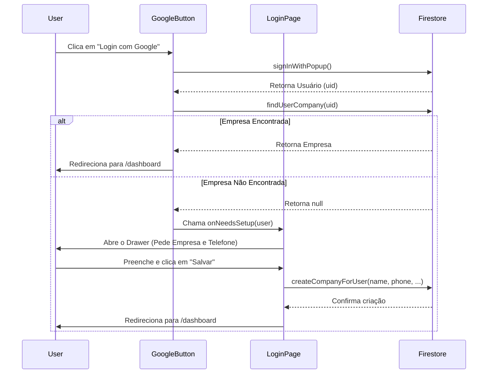

# Fluxo de Login e Configuração Inicial (Onboarding)

Este documento explica passo a passo como o sistema lida com o login do usuário, a verificação da existência de uma empresa (equipe) e o fluxo para coletar os dados iniciais caso o usuário seja novo.

---

## 1. O Início do Login (`GoogleButton.jsx`)

Tudo começa quando o usuário clica no botão "Iniciar ou Entrar com Google".

1. **Autenticação:** O componente chama a função `signInWithPopup(auth, provider)` do Firebase para abrir o pop-up do Google e validar as credenciais.
2. **Verificação de Empresa:** Com o usuário logado (`loggedUser.uid`), o botão chama a função `findUserCompany` para buscar no Firestore se esse usuário já pertence a alguma empresa.
3. **Decisão de Rota:**
   - **Cenário A (Usuário Antigo):** Se a empresa for encontrada, os dados do usuário e da empresa são salvos no estado global (`useStore`) e ele é redirecionado direto para o `/dashboard`.
   - **Cenário B (Novo Usuário):** Se a empresa **não** for encontrada (retornar `null`), o botão aciona uma função callback chamada `onNeedsSetup(loggedUser)`. **Nenhum redirecionamento é feito aqui.**

---

## 2. A Página de Login e o Drawer (`page.jsx`)

A página de login renderiza o `GoogleButton` e passa para ele a prop `onNeedsSetup`. 

Quando o botão detecta que é um novo usuário, ele ativa esse gatilho que faz duas coisas:
1. **Salva o Usuário Temporariamente:** O estado `tempUser` guarda os dados básicos do Google (nome, email, uid).
2. **Abre o Drawer:** O estado `showDrawer` muda para `true`, fazendo a gaveta de "Configuração Inicial" aparecer na tela.

> [!NOTE]
> O usuário fica retido na tela de login, mas visualizando o Drawer. Ele precisa preencher os campos `Empresa/Equipe` e `Telefone` para poder prosseguir.

---

## 3. Salvando os Dados (Ainda em `page.jsx`)

Dentro do Drawer, o usuário preenche os campos e clica em **"Salvar e Continuar"**. Isso dispara a função `handleSaveCompany`:

1. **Validação:** Verifica se os campos não estão em branco.
2. **Criação da Empresa:** Chama a função `createCompanyForUser`, passando o `uid` temporário, os dados do Google, além do `companyName` e `phone` recém-digitados.
3. **Atualização do Estado Global:** Se a empresa for criada com sucesso, o estado global (`setUser`) finalmente é alimentado com todos os dados, confirmando que o usuário agora está 100% ativo e vinculado a uma empresa.
4. **Redirecionamento:** O usuário é encaminhado para o `/dashboard` (`router.push("/dashboard")`).

---

## 4. O Utilitário de Banco de Dados (`utils/company.js`)

Aqui é onde a mágica acontece com o Firebase Firestore:

- **`findUserCompany`:** Faz uma busca na coleção `companies`. A regra é buscar qualquer documento onde o campo `members.{uid}` não seja nulo. Se achar, devolve a empresa.
- **`createCompanyForUser`:** 
  - Gera um novo ID de documento na coleção `companies`.
  - Cria um objeto com as chaves recebidas, incluindo `name`, `phone`, `ownerId` (quem criou), e marca `onboardingComplete: true`.
  - Adiciona o próprio criador dentro do objeto `members` com o cargo (`role`) de `"owner"`.
  - Salva esses dados definitivamente usando `setDoc`.

---

## Resumo Visual do Fluxo

